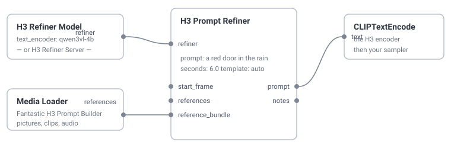

# H3 Prompt Refiner

Write a sentence, get the prompt MiniMax H3 was actually trained to read.

H3 is two models. The hosted half rewrites what you typed into a labelled,
sectioned intermediate representation — Context-IR — and the open weights were
only ever trained on *that*, which is why a plain sentence gets so much less out
of them than the samples suggest. This node is the local stand-in for the half
you did not get: a small vision LLM expands your request, and the field names,
the alignment line, the `[Shot N]` markers and the cut times are assembled
around its prose.

Three nodes, no dependencies, no API key required.

```
cd ComfyUI/custom_nodes
git clone https://github.com/StylusEcho/Comfy-H3-PromptRefiner
```

Restart ComfyUI. Nothing to pip install.

## Where this came from

The refiner is [ComfyUI-Continuity][continuity]'s, by roadmaus, spun out of it
and kept honest. Upstream it is a panel on one large node that also does
sampling, timelines, LoRAs, upscaling, ControlNet and six model families. This
is the prompt rewriting alone, wired to ordinary sockets, for people who have
their own H3 graph and want the prompt half of it.

What came across is the machinery, not a fork of the whole pack: the harness
(`harness.py`), H3's own templates and reply contract (`prompting.py`), the
Context-IR assembly (`contextir.py`), the two backends (`local.py`,
`remote.py`) and the agent-skill loader (`skills.py`), all with their reasoning
intact. What came out is everything that was about Continuity's own state: the
timeline, the cast, the reference pool, the compiler, the blob, the HTTP routes
and the frontend. If you want the whole thing, install upstream instead — the
two packs register different node ids and can live side by side.

## Using it

Wire a backend node into `refiner`, type a prompt, and take `prompt` to your
text encoder.



### The backend

**H3 Refiner Model** loads a Qwen3-VL text encoder in this process. This is the
default and it is the one to want: a second runtime with its own copy of a model
is VRAM ComfyUI can neither see nor reclaim, and on a machine already streaming
H3's own 25 GB encoder off system RAM that is the difference between a rewrite
that takes twenty seconds and one that takes ten minutes. The weights are
released the moment the generation ends, so the sampler downstream gets the
space back.

Put a **Qwen3-VL 4B or 8B** in `models/text_encoders/`. 4B is plenty.

It is **not** H3's own encoder. That checkpoint is Qwen3-VL-32B truncated to 50
of its 64 layers, with no final norm and no language head — a conditioning tap,
not something you can decode text from. Picking it gets you that sentence rather
than noise.

**H3 Refiner Server** talks to an OpenAI-compatible server you already run: LM
Studio, Ollama's `/v1`, llama.cpp's server, vLLM, KoboldCpp, OpenRouter, OpenAI,
or Anthropic's and Gemini's compatibility endpoints. One client covers all of
them — it is a base URL and a model name.

The node takes the **name of an environment variable**, never a key. A widget's
value is saved into the workflow `.json`, and a workflow is a thing people hand
around and paste into issues.

```
export H3_REFINER_API_KEY=sk-...
export H3_REFINER_BASE_URL=https://api.example.com/v1   # optional, and see below
```

Setting `H3_REFINER_BASE_URL` alongside the key **pins** it: the key travels to
that address and nowhere else. Worth doing for a hosted provider — ComfyUI's
server has no authentication, so anyone who can queue a prompt can also edit the
URL widget, and an unpinned key would follow it. A key never rides plain `http`
to anywhere but loopback, whatever is configured.

### The request

`prompt` is the specification, not a suggestion. The refiner expands; it does
not replace. Everything you name survives into the output with its own visual
signature added — a named show or film, a medium, an era, a camera, a palette,
an adjective. Words you put in quotation marks are checked for afterwards and
reported if they did not survive.

`seconds` is how long the finished video runs. It is written into the alignment
line and it is what decides how many shots the rewrite may hold.

`cut_shots` lets the model divide your request into several shots and choose
where the cuts land — one shot per two seconds, up to six. Turn it off for one
unbroken shot.

### The pictures

Attach the same pictures you are about to give the sampler, in the same order.
What is plugged in decides the mode:

| Attached | Mode | What the rewrite is |
|---|---|---|
| nothing | T2VA | a description from nothing |
| `start_frame` | I2VA | opens on exactly that image |
| `end_frame` | L2VA | arrives at exactly that image |
| both | FL2VA | the path from one to the other |
| anything on `references` | REF2VA | the six-section reference form |

`template` pins one of those over the derived answer. The pin is honoured;
crossing into or out of the reference form costs fidelity and the `notes` output
says so.

Labels follow the presentation order, which is not the socket order: every
reference takes the `<Picture N>` it would have had on its own, and the start and
end frames take the ordinals after them. So with two references and a start
frame, the start frame is `<Picture 3>` — feed the encoder in that order.

`reference_takes` narrows what a reference *is*. The default `full` is the whole
picture; `person`, `object`, `scene` and `style` tell the refiner to define that
alone and retain nothing else from the picture, which is the fix for the failure
where one attached photograph becomes the place the model grounds everybody the
request mentions, seen there or not.

### The outputs

`prompt` is the finished document — this is what goes to the text encoder.
`description`, `soundscape` and `music` are the parts, for a graph that wants to
edit one before composing it itself.

`notes` is the one worth reading. It carries what the model says it saw in your
pictures — "did it actually look at them" is the question that field exists to
answer — and four advisory checks on the prose: a citation pointing at nothing,
a label no picture will be given, an attached reference the rewrite never
mentions, and a quoted span from your request that did not survive. They are
notes rather than errors because prose that is one word away from being right
should not be a queue-time refusal.

### Your own instructions

`instructions` is text joined onto the built-in prompting. It outranks the craft
notes and never the reply format.

`skill` runs a file from `h3refiner/skills/`. A bare `.md` or `.txt` is a
paragraph; a `.skill` package or a folder with a `SKILL.md` in it is an agent
skill, handed over whole with its reference files inlined, since a single
generation has no tools and no second turn. `skill_mode` decides what it does:
`add` keeps the harness and joins the text on, `replace` hands the file over as
the entire instruction and takes the reply as the finished document, with
nothing assembled around it. One skill ships with the pack —
`minimax-h3-prompt`, upstream's — and it starts in `replace`.

## Tests

```
sh tests/run.sh
```

No pytest, no torch, no ComfyUI. Every module below `nodes.py` is ordinary data,
which is what makes the interesting half — the reply parsing, the label round
trip, the checks, the key binding — testable at all.

## Thanks

- [ComfyUI-Continuity][continuity] by roadmaus — this is its refiner, and every
  design decision in it is theirs. MIT, and the license came with the code.
- [ComfyUI](https://github.com/comfyanonymous/ComfyUI) by Comfy Org — H3 lives
  in core; this writes prompts for it.
- MiniMax — the H3 prompting guides the templates are distilled from.

## License

[MIT](LICENSE), the same as upstream.

[continuity]: https://github.com/roadmaus/ComfyUI-Continuity
